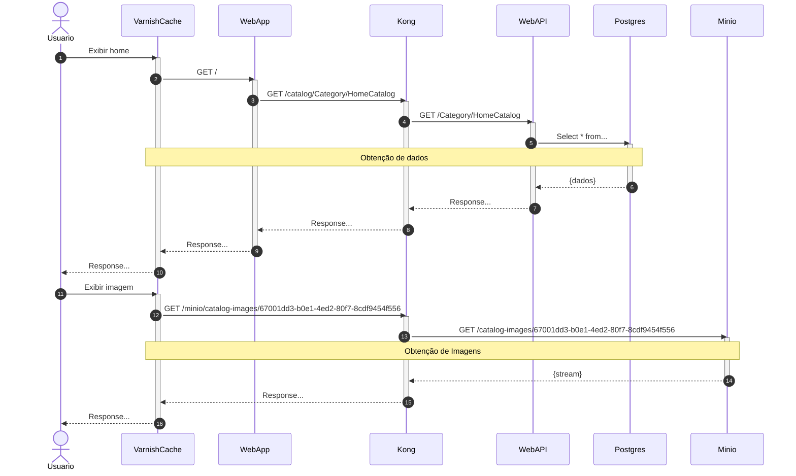

<a href="https://cloudnative.net.br/?utm_source=github&utm_medium=image&utm_campaign=eshop-cloudnative">
   
</a>

# e-Shop | Cloud Native 
## Cloud Native | Cloud Agnostic | Hexagonal Architecture | Event Driven Architecture

Loja Virtual feita com .NET seguindo Cloud Native (Containers, Microservice, DevOps, Continuous Delivery), Cloud Agnostic, Hexagonal Architecture, Event Driven Architecture. Desenvolvido com .NET 6, usando Visual Studio e Docker, pronto para ser executado no kubernetes em produção.

## Baixando o projeto

Esse projeto foi pensado em endereçar problemas reais de um cenário crítico de microsserviços. Assim uma das necessidades em um projeto dessa natureza é poder controlar versões de cada microsserviço de forma independente. Permitindo que os times trabalhem de forma independente. Dada a forma como o git trabalha, gitmodules é uma das estratégias para conseguir o mínimo de sanidade nessa tarefa.

Esse projeto usa git modules, portanto não ignore o parâmetro `--recurse-submodules` na hora do clone.

```
git clone --recurse-submodules https://github.com/luizcarlosfaria/eshop-cloudnative.git
```
## 100% Cloud Agnostic

Nenhuma dependência de NENHUM CLOUD PROVIDER! 

Todas os serviços, aplicações e dependências podem ser instaladas em qualquer Cloud Provider, nosso setup tem única e exclusiva dependência: o Kubernetes.
As instalações podem ser realizadas em qualquer cloud provider, como **Azure**, **AWS**, **GCP** em soluções como **AKS**, **EKS** ou **GKE** ou ainda em serviços como **Hetzner**, **Scaleway** e **Digital Ocean** ou mesmo em **máquinas virtuais** ou **bare metal** na nuvem ou On-Premise.

Um dos objetivos desse projeto é demonstrar como podemos não depender dos Cloud Providers para criar soluções incríveis.

## Sub Modules

### [Infra](../../../eshop-cloudnative-infra) | Infraestrutura de Produção

### [Catalog](../../../eshop-cloudnative-catalog) | Produtos, Categorias, Menu, Imagens

### [Profile](../../../eshop-cloudnative-profile) | Endereço e Dados Pessoais

## Foco da Solução

* Backend

* Arquitetura

* Containers

* Microsserviços

* Mensageria

* Event Driven Architecture
 
* Agnostic Service

* Hexagonal Architecture

# Entendendo a stack



O Varnish tem o papel de simular Akamai e qualquer outro cache service. 

A web app é nossa aplicação web. Nesse momento ela ainda é uma aplicação ASP.NET Core MVC, com front-end desenvolvido com Tailwind CSS e VueJS.

Entre a aplicação web e a WebAPI temos o Kong como nosso API Gateway. 

Todas as API's só aceitam requisições oriundas do Kong. Assim garantimos autenticação (e não autorização), visando conseguir determinar com clareza, quais serviços estão consumindo quais API's. No banco de dados temos o Postgres, implantado no Kubernetes em um cluster totalizando 1 master e 2 replicas. 

O minio é nosso Object Storage, ele, assim como o cluster RabbitMQ e o cluster Postgres estão usando Longhorn para block storage com volumes replicados em todo o cluster.

# Entendendo os serviços

<a href="https://gago.io/arquitetura/">
   
</a>

# Projeto final Cloud Native .NET

Esse projeto tem a missão de ser o projeto final do Cloud Native .NET. 

Ele aglutina diversas jornadas de entendimento do desenho de uma arquitetura. Com ele podemos falar de agnóstic services, podemos falar de mensageria, de event driven architecture, de injeção de dependência, de exception management, de alm, gerência de configuração, RabbitMQ, Redis, Logging, Métricas, API Gateway e muito mais.

Caso queira participar e ver aulas sobre esse projeto, visite [cloudnative.net.br](https://cloudnative.net.br/?utm_source=github&utm_medium=markdown&utm_campaign=eshop-cloudnative) e descubra como se tornar aluno.

# Quer entender as decisões técnicas desse projeto?

Esse projeto conta com um **Decision Log** contendo todas as grandes decisões de arquitetura, design e estratégia de codificação do projeto. 

<a href="https://github.com/users/luizcarlosfaria/projects/2/views/2">
   
</a>

Parte importante é demonstrar como conseguimos endereçar cada assunto do nosso board no código.
